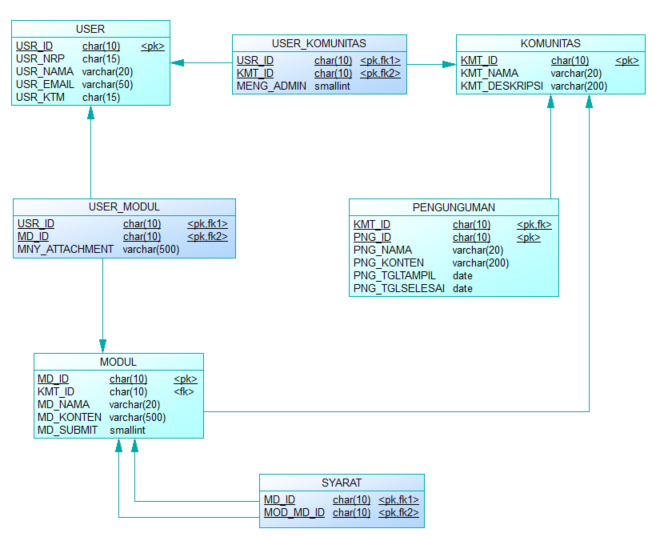

# Web Elearning Tekno

## Table of Contents

[TOC]


## Cara Install
1. Clone repo
2. Jalankan composer install
3. Copy .env.example ke .env
4. Set nama database dengan user dan password yang benar di .env
5. php artisan key:generate
6. php artisan migrate
***
## Code Convention
Hal yang harus diperhatikan dalam kodingan, untuk mempermudah pembacaan.
- Class: PascalCase
- Function: camelCase
- Variable: snake_case
- diroute jangan ada return langsung passing ke controller dulu
- pakai use jangan akses langsung pada direktorinya 
- Buat branch tiap fitur yang dikerjakan, jangan kerjakan fitur di branch master
***
## Struktur DB


Ada sedikit perbedaan nama tabel/attribut, akan yang diikuti yang ada pada migration.
***
## Hal yang harus dilakukan jika tidak mengerti
Lihat Model dan Controller  
Lihat Routingan  
Google

***
## To Do List
 - Untuk siraj

Buat middleware untuk verifikasi admin

### Fitur fitur
- Modul  
CRUD Modul  
Menggunakan wysiwyg

- Komunitas  
CRUD Komunitas  
CRUD Pengunguman

- User  
    * User biasa  
    Bisa pilih komunitas  
    Bisa daftar
* Admin komunitas  
    Bisa menerima request masuk komunitas  
    * Admin  
Bisa assign admin

## Sitemap

- `/`

  Homepage. Berisi login dan register saja.

  - `/login`

    Halaman login

  - `/register`

    Halaman register

  - `/dashboard`

    Berisi list **semua** komunitas.

  - `/komunitas/{kmt_id}`

    Berisi list modul yang tersedia dalam komunitas tersebut.

    - `/komunitas/{kmt_id}/{md_id}`

      Berisi **satu** modul.

  - `/admin`

    Dashboard untuk admin (web dan komunitas). Berisi 

    - View admin web: CRUD user dan komunitas

    - View admin komunitas: list komunitas yang ditangani

    - `/admin/{kmt_id}`

      CRUD komunitas terkait (modul dan member komunitas).

## Role dan Ability untuk User

Implementasi role dan ability menggunakan [Bouncer](https://github.com/JosephSilber/bouncer).

### Role

Role yang tersedia:

- `'admin'`: Admin. Mengatur seluruh web.
- `'admin-komunitas'`: Admin komunitas. Mengatur keseluruhan dari sebuah komunitas.
- `'user'`: User biasa.

### Ability

Untuk mengecek apakah sebuah user memiliki ability di bawah, gunakan `$user->can('nama-ability')`.

Ability yang tersedia:

- `'crud-users'`: Membuat, mengedit, dan menghapus user. Dimiliki oleh role: `'admin'`.
- `'crud-admins'`: Menambahkan atau menghapus role `'admin'` dari sebuah user. Dimiliki oleh role: `'admin'`.
- `'crud-admin-komunitas'`: Mengangkat atau menurunkan admin komunitas. Dimiliki oleh role: `'admin'`.
- `'crud-komunitas'`: Membuat, mengedit, menghapus komunitas. Dimiliki oleh role: `'admin'`.
- `'crud-modul'`: Membuat, mengedit, menghapus modul dari sebuah komunitas. Dimiliki oleh `'admin-komunitas'` pada model `$komunitas` tertentu.
- `'crud-member'`: Bisa menambahkan, menghapus member dari komunitas. Dimiliki oleh `'admin-komunitas'` pada model `$komunitas` tertentu.

### Implementasi

Untuk mengecek role:

```php
$user->isA('nama-role'); //return boolean
```

Untuk mengecek ability:

```php
$user->can('nama-ability'); //return boolean
$user->can('nama-ability', $model); //return boolean
```

Untuk assign role:

```php
$user->assign('nama-role');
```

Untuk assign ability:

```php
$user->allow('nama-ability');
$user->allow('nama-ability', $model);
```

**Catatan**: Pastikan assign ability ke user sesuai dengan role.

